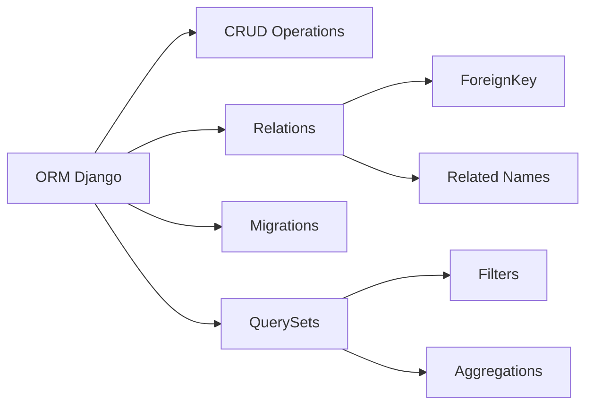

<div align="center">

# ✈️ Ynov Air - Application de Réservation de Vols


**Application web de démonstration pour la réservation de vols aériens**
Développée avec Django pour un cours sur les ORM et bases de données

[Installation](#-installation-et-déploiement-local) • [Fonctionnalités](#-fonctionnalités) • [Documentation](#-utilisation-pour-les-étudiants)

</div>

---

## 🚀 Fonctionnalités

<table>
<tr>
<td width="50%">

### 🔍 Recherche de vols
Recherche intuitive par aéroport de départ, d'arrivée et date

### 📝 Système de réservation
Réservation complète avec gestion des passagers et confirmation

### 💺 Gestion des sièges
Tracking automatique de la disponibilité des sièges en temps réel

### 👤 Authentification utilisateur
Système complet d'inscription, connexion et gestion de profil

</td>
<td width="50%">

### 📦 **Gestion des objets perdus** ⭐ NEW
Système complet de déclaration et réclamation d'objets trouvés

### ⚙️ Interface d'administration
Panel d'administration complet via Django Admin

### 🎨 Design Ynov
Interface moderne aux couleurs de l'école (vert `#00b894`)

### 📊 Données de démonstration
Base pré-remplie avec 650+ vols, 50 objets perdus et 10 aéroports

</td>
</tr>
</table>

### ✨ Fonctionnalité Principale : Gestion des Objets Perdus

Un système complet permettant de gérer le cycle de vie des objets perdus dans l'aéroport :

- 🔍 **Recherche et filtrage** par catégorie, statut, mots-clés
- 📝 **Signalement** d'objets trouvés (réservé aux administrateurs)
- 👋 **Réclamation** d'objets par les utilisateurs avec preuves
- 📊 **Suivi du workflow** : Signalé → Trouvé → Réclamé → Restitué
- 🔐 **Permissions différenciées** entre utilisateurs et administrateurs
- 📧 **Coordonnées** du découvreur et du réclamant
- ✈️ **Liaison avec les vols** pour tracer l'origine de la perte

## 📦 Modèles de données (ORM)

L'application utilise **5 modèles principaux** démontrant les concepts clés de l'ORM Django :

```python
┌─────────────┐         ┌─────────────┐
│   Airport   │◄────────┤    Flight   │
│             │         │             │
│  - code     │         │  - number   │
│  - name     │         │  - price    │
│  - city     │         │  - seats    │
└─────────────┘         └──────┬──────┘
                               │
                       ┌───────┴───────┐
                       │               │
                       ▼               ▼
                ┌─────────────┐  ┌──────────────┐
                │   Booking   │  │ LostObject   │ ⭐ NEW
                │             │  │              │
                │  - ref      │  │  - ref_num   │
                │  - status   │  │  - category  │
                │  - price    │  │  - status    │
                └──────┬──────┘  │  - location  │
                       │         └──────────────┘
                       │ ForeignKey
                       ▼
                ┌──────────────┐         ┌──────────────┐
                │  Passenger   │         │   User       │
                │              │         │  (Django)    │
                │  - name      │◄────────┤              │
                │  - email     │         │  - username  │
                │  - passport  │         │  - email     │
                └──────────────┘         └──────────────┘
```

### 🔗 Relations ORM démontrées

| Concept | Utilisation | Exemple |
|---------|-------------|---------|
| **ForeignKey** | Relations entre modèles | `Flight.origin → Airport`, `LostObject.flight → Flight` |
| **Validators** | Validation des données | `MinValueValidator`, `MaxValueValidator` |
| **Choices** | Statuts prédéfinis | `STATUS_CHOICES` pour vols/réservations/objets perdus |
| **auto_now_add** | Timestamps auto | `booking_date`, `date_found`, `created_at` |
| **auto_now** | MAJ timestamp | `updated_at` dans LostObject |
| **Related names** | Navigation inverse | `airport.departures.all()`, `flight.lost_objects.all()` |
| **ON DELETE SET NULL** | Comportement suppression | Objet perdu conservé même si vol supprimé |
| **Unique constraints** | Unicité garantie | `reference_number` dans LostObject |

### 📋 Nouveau Modèle : LostObject

```python
class LostObject(models.Model):
    # Identification
    reference_number = models.CharField(max_length=10, unique=True)  # Auto-généré (LO123456)
    item_name = models.CharField(max_length=200)
    category = models.CharField(max_length=20, choices=CATEGORY_CHOICES)
    description = models.TextField()
    
    # Détails optionnels
    color = models.CharField(max_length=50, blank=True, null=True)
    brand = models.CharField(max_length=100, blank=True, null=True)
    
    # Localisation
    location_found = models.CharField(max_length=200)
    flight = models.ForeignKey(Flight, on_delete=models.SET_NULL, null=True, blank=True)
    date_found = models.DateTimeField(auto_now_add=True)
    
    # Workflow
    status = models.CharField(max_length=20, choices=STATUS_CHOICES, default='REPORTED')
    
    # Découvreur
    finder_name = models.CharField(max_length=200, null=True, blank=True)
    finder_email = models.EmailField(null=True, blank=True)
    finder_phone = models.CharField(max_length=20, null=True, blank=True)
    
    # Réclamant
    claimer_name = models.CharField(max_length=200, null=True, blank=True)
    claimer_email = models.EmailField(null=True, blank=True)
    claimer_phone = models.CharField(max_length=20, null=True, blank=True)
    claim_date = models.DateTimeField(null=True, blank=True)
    claim_details = models.TextField(null=True, blank=True)
    
    # Restitution
    returned_date = models.DateTimeField(null=True, blank=True)
    
    # Système
    user = models.ForeignKey(User, on_delete=models.SET_NULL, null=True, blank=True)
    created_at = models.DateTimeField(auto_now_add=True)
    updated_at = models.DateTimeField(auto_now=True)
```

**Catégories disponibles :** Electronics, Documents, Luggage, Clothing, Accessories, Jewelry, Books, Other

**Workflow de statuts :** REPORTED → FOUND → CLAIMED → RETURNED

## 🛠️ Installation et déploiement local

### 📋 Prérequis

-  Python 3.8 ou supérieur
-  pip (gestionnaire de paquets Python)

### 📥 Étapes d'installation

> **Note** : Ces commandes doivent être exécutées dans le terminal/invite de commandes

1. **Cloner ou télécharger le projet**

2. **Créer un environnement virtuel** (optionnel mais recommandé)
   ```bash
   python -m venv ynov_air
   ```

3. **Activer l'environnement virtuel**
   - Windows :
     ```bash
     ynov_air\Scripts\activate
     ```
   - Linux/Mac :
     ```bash
     source ynov_air/bin/activate
     ```

4. **Installer Django**
   ```bash
   pip install django
   ```

5. **Se placer dans le dossier ynovair**
   ```bash
   cd ynovair
   ```

6. **Créer les migrations** (si nécessaire)
   ```bash
   python manage.py makemigrations
   ```

7. **Appliquer les migrations**
   ```bash
   python manage.py migrate
   ```

8. **Peupler la base de données avec des données de démonstration**
   ```bash
   python generate_data.py
   ```
   
   Ce script génère automatiquement :
   - 50 passagers avec informations réalistes
   - 50 vols entre différents aéroports
   - 50 réservations associées
   - 50 objets perdus avec différents statuts
   - Aéroports français et européens (si nécessaire)
   - Comptes utilisateurs de test (admin/testuser)

9. **Créer un superutilisateur** (pour accéder à l'admin)
   ```bash
   python manage.py createsuperuser
   ```
   Suivez les instructions (username, email, password)

10. **Lancer le serveur de développement**
    ```bash
    python manage.py runserver
    ```

11. **Accéder à l'application**

    | Interface | URL | Description |
    |-----------|-----|-------------|
    | 🌐 **Site public** | http://127.0.0.1:8000/ | Recherche et réservation de vols |
    | 📦 **Objets perdus** | http://127.0.0.1:8000/lost-objects/ | Consultation et réclamation d'objets |
    | ⚙️ **Admin Panel** | http://127.0.0.1:8000/admin/ | Gestion complète des données |

### 🔑 Comptes de test

Après avoir exécuté `generate_data.py`, vous disposez de :

| Compte | Username | Password | Rôle |
|--------|----------|----------|------|
| **Administrateur** | admin | admin123 | Superuser (peut tout faire) |
| **Utilisateur test** | testuser | testpass123 | Utilisateur simple (peut réclamer) |

---

## 🎓 Utilisation pour les étudiants

### Exercices ORM suggérés

Dans le shell Django (`python manage.py shell`), essayez :

```python
from flights.models import Airport, Flight, Passenger, Booking, LostObject
from django.utils import timezone
from django.contrib.auth.models import User

# ============= BASICS =============
# Lire tous les aéroports
airports = Airport.objects.all()

# Filtrer les vols par origine
flights_from_paris = Flight.objects.filter(origin__city="Paris")

# Compter les vols disponibles
available_flights = Flight.objects.filter(status='SCHEDULED', available_seats__gt=0).count()

# ============= RELATIONS (JOINS) =============
# Recherche avec JOIN (ForeignKey)
cdg = Airport.objects.get(code="CDG")
cdg_departures = cdg.departures.all()

# Objets perdus d'un vol spécifique
flight = Flight.objects.first()
lost_items = flight.lost_objects.all()

# ============= AGGREGATIONS =============
from django.db.models import Avg, Sum, Count, Max, Min

# Statistiques sur les vols
avg_price = Flight.objects.aggregate(Avg('price'))
total_seats = Flight.objects.aggregate(Sum('total_seats'))

# Statistiques objets perdus par catégorie
stats = LostObject.objects.values('category').annotate(count=Count('id'))

# Objets perdus par statut
by_status = LostObject.objects.values('status').annotate(
    total=Count('id')
).order_by('-total')

# ============= REQUÊTES COMPLEXES (Q Objects) =============
from django.db.models import Q

# Vols depuis ou vers Paris
flights = Flight.objects.filter(
    Q(origin__city="Paris") | Q(destination__city="Paris")
)

# Objets perdus électroniques OU de grande valeur (Jewelry)
valuable_items = LostObject.objects.filter(
    Q(category='ELECTRONICS') | Q(category='JEWELRY')
)

# Objets réclamés ou restitués
claimed_items = LostObject.objects.filter(
    Q(status='CLAIMED') | Q(status='RETURNED')
)

# ============= LOST OBJECTS - EXEMPLES SPÉCIFIQUES =============
# Tous les objets trouvés disponibles
available_items = LostObject.objects.filter(status='FOUND')

# Recherche par mots-clés
iphone_items = LostObject.objects.filter(
    Q(item_name__icontains='iphone') | 
    Q(description__icontains='iphone')
)

# Objets perdus dans les 7 derniers jours
from datetime import timedelta
recent_items = LostObject.objects.filter(
    date_found__gte=timezone.now() - timedelta(days=7)
)

# Objets avec réclamation en attente
pending_claims = LostObject.objects.filter(
    status='CLAIMED',
    returned_date__isnull=True
)

# Statistiques de restitution
return_rate = LostObject.objects.filter(status='RETURNED').count() / LostObject.objects.count() * 100

# Objets par localisation
by_location = LostObject.objects.values('location_found').annotate(
    count=Count('id')
).order_by('-count')

# ============= CRÉER DES DONNÉES =============
# Créer un passager
passenger = Passenger.objects.create(
    first_name="Jean",
    last_name="Dupont",
    email="jean.dupont@example.com",
    phone="0612345678",
    passport_number="12AB34567",
    date_of_birth="1990-01-01"
)

# Créer une réservation
flight = Flight.objects.first()
booking = Booking.objects.create(
    booking_reference="TEST1234",
    flight=flight,
    passenger=passenger,
    number_of_passengers=1,
    total_price=flight.price,
    status='CONFIRMED'
)

# Signaler un objet perdu (admin seulement)
admin_user = User.objects.filter(is_superuser=True).first()
lost_item = LostObject.objects.create(
    item_name="iPhone 15 Pro",
    category="ELECTRONICS",
    description="iPhone noir 256GB avec coque bleue",
    color="Noir",
    brand="Apple",
    location_found="Terminal 2 - Porte 15",
    flight=flight,
    status="FOUND",
    finder_name="Agent Sécurité",
    finder_email="security@airport.com",
    finder_phone="0123456789",
    user=admin_user
)

# Réclamer un objet
lost_item.claimer_name = "Jean Dupont"
lost_item.claimer_email = "jean.dupont@email.com"
lost_item.claimer_phone = "0612345678"
lost_item.claim_details = "C'est mon iPhone, numéro de série: ABC123XYZ"
lost_item.claim_date = timezone.now()
lost_item.status = "CLAIMED"
lost_item.save()

# ============= OPTIMISATION =============
# Éviter les N+1 queries avec select_related (ForeignKey)
flights = Flight.objects.select_related('origin', 'destination').all()

# Éviter les N+1 queries avec prefetch_related (reverse ForeignKey)
flights_with_bookings = Flight.objects.prefetch_related('bookings').all()

# Objets perdus avec détails du vol
items = LostObject.objects.select_related('flight', 'flight__origin', 'flight__destination', 'user').all()
```

### 💡 Concepts ORM à explorer

<details>
<summary><b>📚 Liste des 15 concepts essentiels</b> (cliquer pour développer)</summary>

| # | Concept | Description | Difficulté | Exemple dans le projet |
|---|---------|-------------|------------|----------------------|
| 1 | **CRUD Operations** | Create, Read, Update, Delete | 🟢 Débutant | `LostObject.objects.create()` |
| 2 | **QuerySets** | `filter()`, `exclude()`, `get()`, `all()` | 🟢 Débutant | `LostObject.objects.filter(status='FOUND')` |
| 3 | **Relations** | ForeignKey, related_name | 🟡 Intermédiaire | `flight.lost_objects.all()` |
| 4 | **Aggregations** | Count, Sum, Avg, Max, Min | 🟡 Intermédiaire | `objects.aggregate(Avg('price'))` |
| 5 | **Annotations** | Ajouter des champs calculés | 🟡 Intermédiaire | `values('status').annotate(count=Count('id'))` |
| 6 | **F expressions** | Opérations au niveau BDD | 🟠 Avancé | `filter(available_seats__gt=F('total_seats')/2)` |
| 7 | **Q objects** | Requêtes complexes (OR, AND, NOT) | 🟠 Avancé | `Q(status='FOUND') \| Q(status='CLAIMED')` |
| 8 | **Transactions** | `atomic()`, `commit()`, `rollback()` | 🟠 Avancé | `@transaction.atomic` dans `save()` |
| 9 | **Signals** | `pre_save`, `post_save`, `pre_delete` | 🔴 Expert | Auto-génération référence |
| 10 | **Custom Managers** | Méthodes personnalisées | 🔴 Expert | Managers custom pour filtrage |
| 11 | **select_related** | Optimisation JOIN (ForeignKey) | 🟡 Intermédiaire | `select_related('flight', 'user')` |
| 12 | **prefetch_related** | Optimisation reverse FK | 🟠 Avancé | `prefetch_related('lost_objects')` |
| 13 | **auto_now / auto_now_add** | Timestamps automatiques | 🟢 Débutant | `created_at`, `updated_at` |
| 14 | **Choices** | Énumérations prédéfinies | 🟢 Débutant | `CATEGORY_CHOICES`, `STATUS_CHOICES` |
| 15 | **ON DELETE CASCADE/SET NULL** | Comportement suppression | 🟡 Intermédiaire | `on_delete=models.SET_NULL` |

</details>

### 🎯 Cas d'usage concrets - Objets Perdus

<details>
<summary><b>📋 Scénarios réels d'utilisation</b></summary>

#### 1. **Recherche Multi-Critères**
```python
# Rechercher des iPhone noirs trouvés dans les 7 derniers jours
from datetime import timedelta
from django.utils import timezone

items = LostObject.objects.filter(
    Q(item_name__icontains='iphone') | Q(description__icontains='iphone'),
    color__icontains='noir',
    date_found__gte=timezone.now() - timedelta(days=7),
    status='FOUND'
)
```

#### 2. **Statistiques par Période**
```python
# Objets perdus par mois avec taux de restitution
from django.db.models.functions import TruncMonth

stats = LostObject.objects.annotate(
    month=TruncMonth('date_found')
).values('month').annotate(
    total=Count('id'),
    returned=Count('id', filter=Q(status='RETURNED')),
).order_by('-month')
```

#### 3. **Objets Non Réclamés Depuis Plus de 30 Jours**
```python
from django.db.models import F
from datetime import timedelta

unclaimed = LostObject.objects.filter(
    status='FOUND',
    date_found__lt=timezone.now() - timedelta(days=30)
).select_related('flight')
```

#### 4. **Top 5 Catégories d'Objets Perdus**
```python
top_categories = LostObject.objects.values('category').annotate(
    count=Count('id')
).order_by('-count')[:5]
```

#### 5. **Objets Perdus par Vol**
```python
# Vols avec le plus d'objets perdus
flights_with_items = Flight.objects.annotate(
    lost_count=Count('lost_objects')
).filter(lost_count__gt=0).order_by('-lost_count')
```

</details>

## 📁 Structure du projet

```
ynovair/
├── 📂 flights/                      # 🎯 Application principale
│   ├── 📄 models.py                 # Modèles ORM (Airport, Flight, Passenger, Booking, LostObject)
│   ├── 📄 views.py                  # Vues (home, search, booking, lost objects, etc.)
│   ├── 📄 urls.py                   # Routes URL
│   ├── 📄 admin.py                  # Configuration admin avec actions personnalisées
│   ├── 📄 auth_views.py             # Vues d'authentification
│   ├── 📂 management/commands/
│   │   └── 📄 populate_data.py      # Commande pour peupler la BDD (legacy)
│   └── 📂 migrations/               # Migrations de base de données
│       ├── 📄 0001_initial.py       # Tables initiales
│       ├── 📄 0002_booking_user.py  # Ajout user aux bookings
│       └── 📄 0003_lostobject.py    # Nouvelle table objets perdus ⭐
│
├── 📂 ynov_air/                     # ⚙️ Configuration du projet
│   ├── 📄 settings.py               # Paramètres Django
│   ├── 📄 urls.py                   # URLs principales
│   └── 📄 wsgi.py                   # Point d'entrée WSGI
│
├── 📂 templates/flights/            # 🎨 Templates HTML
│   ├── 📄 base.html                 # Template de base avec navigation
│   ├── 📄 home.html                 # Page d'accueil
│   ├── 📄 search.html               # Recherche de vols
│   ├── 📄 flight_detail.html        # Détails d'un vol
│   ├── 📄 booking_create.html       # Formulaire de réservation
│   ├── 📄 booking_detail.html       # Confirmation
│   ├── 📄 my_bookings.html          # Liste des réservations
│   ├── 📄 login.html                # Connexion
│   ├── 📄 register.html             # Inscription
│   ├── 📄 profile.html              # Profil utilisateur
│   ├── 📄 profile_update.html       # Modification profil
│   ├── 📄 lost_objects_list.html    # Liste objets perdus ⭐
│   ├── 📄 lost_object_detail.html   # Détail objet perdu ⭐
│   ├── 📄 lost_object_report.html   # Signaler objet (admin) ⭐
│   ├── 📄 lost_object_claim.html    # Réclamer objet ⭐
│   └── 📄 my_lost_objects.html      # Mes signalements (admin) ⭐
│
├── 📂 static/css/                   # 💅 Fichiers statiques
│   └── 📄 style.css                 # Styles CSS (couleurs Ynov)
│
├── 📄 manage.py                     # 🔧 Utilitaire Django
├── 📄 generate_data.py              # 🎲 Script génération données test ⭐
├── 📄 documentation.md              # 📚 Documentation complète du projet ⭐
├── 📄 db.sqlite3                    # 💾 Base de données SQLite
├── 📄 .gitignore                    # 🚫 Fichiers à ignorer
└── 📄 README.md                     # 📖 Ce fichier
```

### 🆕 Nouveaux fichiers ajoutés

| Fichier | Description |
|---------|-------------|
| `generate_data.py` | Script Python pour générer 50 entrées de test par modèle |
| `documentation.md` | Documentation technique complète avec schémas SQL et requêtes |
| `0003_lostobject.py` | Migration Django pour la table objets perdus |
| Templates objets perdus | 5 nouveaux templates HTML pour la fonctionnalité |

---

## 🔧 Technologies utilisées

<div align="center">

| Technologie | Utilisation | Version |
|-------------|-------------|---------|
|  | Framework web Python | 5.2 |
|  | Base de données | 3 |
|  | Langage backend | 3.8+ |
|  | Structure pages | 5 |
|  | Style interface | 3 |

</div>

---

## 🎯 Points d'apprentissage clés



<details>
<summary><b>📖 Détails des concepts</b></summary>

| Concept | Description | Exemple dans le projet |
|---------|-------------|----------------------|
| **ORM vs SQL** | Abstraction de la base de données | `Flight.objects.all()` vs `SELECT * FROM flights` |
| **Migrations** | Gestion du schéma BDD | Fichiers dans `migrations/` |
| **Relations** | One-to-Many, Many-to-Many | `Flight → Airport` (ForeignKey) |
| **Validation** | Validators Django | `MinValueValidator(0)` |
| **Optimisation** | `select_related()`, `prefetch_related()` | Réduction des requêtes SQL |
| **Transactions** | Cohérence des données | `@transaction.atomic` dans `save()` |
| **Signals** | Logique automatisée | Events sur save/delete |

</details>

---

## ⚠️ Notes importantes

> **🎓 Usage pédagogique uniquement**

- ⚠️ La `SECRET_KEY` est visible (à changer en production)
- ⚠️ `DEBUG = True` activé (à désactiver en production)
- ✅ SQLite suffisant pour développement local
- ✅ Données de démonstration incluses
- ✅ Système de permissions implémenté (superuser vs utilisateur)
- ✅ Script de génération de données (`generate_data.py`)

### 🔒 Permissions et Sécurité

**Objets Perdus - Restrictions d'accès :**

| Action | Utilisateur Simple | Administrateur |
|--------|-------------------|----------------|
| 👀 Voir la liste | ✅ Autorisé | ✅ Autorisé |
| 🔍 Voir les détails | ✅ Autorisé | ✅ Autorisé |
| ➕ Signaler un objet trouvé | ❌ Interdit | ✅ Autorisé |
| 👋 Réclamer un objet | ✅ Autorisé | ✅ Autorisé |
| ✏️ Modifier le statut | ❌ Interdit | ✅ Autorisé (via admin) |
| 📊 Voir "Mes signalements" | ❌ Interdit | ✅ Autorisé |

**Actions Admin disponibles :**
- Marquer comme restitué (action groupée)
- Remettre au statut trouvé (annuler réclamation)
- Modification manuelle de tous les champs

---

## 📚 Documentation et support

<div align="center">

[](https://docs.djangoproject.com/fr/5.2/topics/db/)
[](https://docs.python.org/3/)

</div>

### 📖 Documentation du Projet

- 📋 **[documentation.md](./ynovair/documentation.md)** - Documentation technique complète
  - Modélisation de la base de données
  - Scripts SQL de création
  - Requêtes SQL documentées
  - Analyse de performance
  - Guide d'optimisation

- 🎯 **[LOST_OBJECTS_FEATURE.md](./LOST_OBJECTS_FEATURE.md)** - Documentation de la fonctionnalité (si existant)

### 🆘 Besoin d'aide ?

- 📖 [Documentation officielle Django ORM](https://docs.djangoproject.com/fr/5.2/topics/db/)
- 📝 [Django QuerySet API Reference](https://docs.djangoproject.com/fr/5.2/ref/models/querysets/)
- 💬 [Django Community](https://www.djangoproject.com/community/)
- 🎥 [Tutoriels Django (français)](https://docs.djangoproject.com/fr/5.2/intro/tutorial01/)
- 🔍 [Django Girls Tutorial](https://tutorial.djangogirls.org/fr/)

### 🚀 Ressources d'Apprentissage

| Ressource | Type | Niveau |
|-----------|------|--------|
| [Django ORM Cookbook](https://books.agiliq.com/projects/django-orm-cookbook/en/latest/) | Livre en ligne | 🟡 Intermédiaire |
| [Real Python - Django](https://realpython.com/tutorials/django/) | Tutoriels | 🟢 Tous niveaux |
| [Django for Beginners](https://djangoforbeginners.com/) | Livre | 🟢 Débutant |
| [Two Scoops of Django](https://www.feldroy.com/books/two-scoops-of-django-3-x) | Livre | 🟠 Avancé |

---

## 🎯 Fonctionnalités Détaillées

### 🔐 Système d'Authentification
- Inscription avec validation des données
- Connexion/déconnexion sécurisée
- Profil utilisateur éditable
- Gestion des sessions Django

### ✈️ Gestion des Vols
- Recherche multi-critères (origine, destination, date)
- Affichage des détails complets (durée, prix, sièges)
- Statuts en temps réel (Programmé, Embarquement, Décollé, Atterri, Annulé)
- Gestion automatique de la disponibilité des sièges

### 📝 Réservations
- Création de réservation avec informations passager
- Génération automatique de référence unique (8 caractères)
- Calcul automatique du prix total
- Attribution de numéros de siège
- Suivi des réservations personnelles
- Statuts : En attente, Confirmée, Annulée, Terminée

### 📦 Objets Perdus (Nouvelle Fonctionnalité)

#### Pour tous les utilisateurs :
- 📋 Consultation de la liste complète des objets
- 🔍 Recherche par mots-clés (nom, description, référence)
- 🏷️ Filtrage par catégorie (8 catégories disponibles)
- 📊 Filtrage par statut (Signalé, Trouvé, Réclamé, Restitué)
- 👀 Visualisation des détails complets
- 👋 Soumission de réclamations avec preuves

#### Pour les administrateurs uniquement :
- ➕ Signalement d'objets trouvés avec localisation
- ✏️ Modification du statut et des informations
- 📊 Vue des signalements personnels
- ✅ Actions groupées (marquer comme restitué, réinitialiser)
- 🔗 Association avec un vol spécifique

#### Workflow complet :
1. **Admin trouve un objet** → Le signale dans le système
2. **Utilisateur voit l'objet** → Remplit une réclamation
3. **Admin vérifie** → Contacte le réclamant
4. **Validation** → Marque comme restitué

#### Champs trackés :
- Informations objet : nom, catégorie, description, couleur, marque
- Localisation : lieu de découverte, vol associé, date
- Découvreur : nom, email, téléphone
- Réclamant : nom, email, téléphone, détails/preuves
- Dates : découverte, réclamation, restitution
- Numéro de référence unique (format: LO123456)

---

## 👨‍🎓 Auteur

**Application développée pour Ynov**
Cours sur les bases de données et ORM - 3ème année

### 📊 Statistiques du Projet

- **Modèles Django** : 5 (Airport, Flight, Passenger, Booking, LostObject)
- **Templates HTML** : 15+
- **Vues** : 20+
- **URLs** : 18
- **Migrations** : 3
- **Lignes de code Python** : ~1500
- **Catégories d'objets** : 8
- **Statuts workflow** : 4
- **Actions admin** : 2 personnalisées

---

<div align="center">

Made with ❤️ for Ynov students


**⭐ N'oubliez pas de star ce projet si vous le trouvez utile !**

</div>
